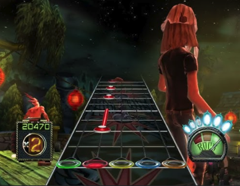
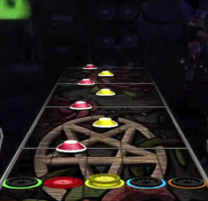

# Guitar Hero Interactions

I enjoy playing rhythm games in my free time. One of my all time favorites is Guitar Hero III: Legends of Rock for the Wii, but I also enjoy the other games in the series. The creators of Guitar Hero aimed to make users feel like they were actually playing the music in each level, so they created a custom controller: It is shaped like a guitar, has 5 buttons that act as frets, a strum bar, and a few other miscellaneous buttons.

With a 1-dimensional array of buttons and a single strum bar, it's nearly impossible to mimic playing the actual song, but there are certain mechanics implemented in the game to make it feel more natural. The screenshot below shows repeated red notes. When I first played, I thought you had to press the red button exactly when it crossed the corresponding red circle (and then strum). Instead, you can hold the red button down beforehand and only strum at the right time. This gives the player time to prepare the upcoming note/chord, and it feels more like how you would play a real guitar.

The next mechanic that took me awhile to learn was hammer-ons and pull-offs. On a real guitar, you can strum a note on a string and then without strumming again, "hammer down" your finger on a **higher** fret on that string. The opposite of that is called a pull-off, where you sound a second, **lower** note by pulling your fretting finger off a higher note, essentially strumming the string with your finger. Hammer-ons and pull-offs are identified in Guitar Hero by the white light that beams from the center of the note. For the screenshot below: At first, I thought you needed to tap each note independently, but the game allows the player to hold the lower note (red) and tap the yellow notes when they arrive. This means less finger movement for the player, a closer experience to guitar, and overall more enjoyment.

